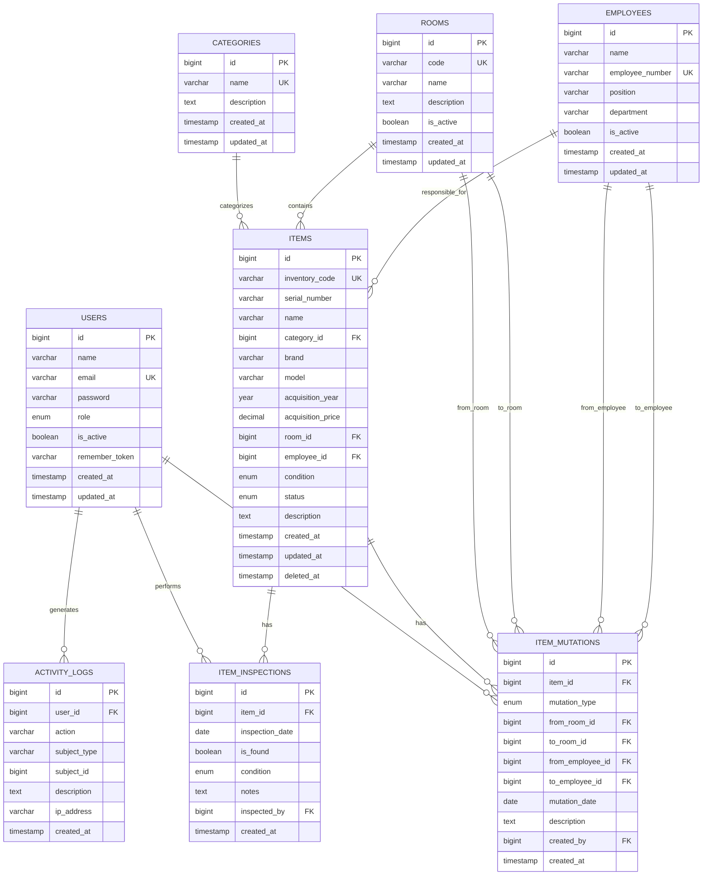

# ERD — Sistem Informasi Inventaris Barang
## Kantor Cabang Disdukcapil

**Version:** 1.0  
**Database:** MySQL  
**ORM:** Laravel Eloquent

---

# 1. Database Overview

Database dirancang untuk **satu kantor cabang**.

Tidak terdapat:
- `offices`
- `branches`
- `branch_id`
- `office_id`
- `parent_office_id`

Lokasi fisik barang direpresentasikan oleh tabel `rooms`.

Penanggung jawab barang direpresentasikan oleh tabel `employees`.

Database terdiri dari 8 tabel:
1. `users`
2. `categories`
3. `rooms`
4. `employees`
5. `items`
6. `item_mutations`
7. `item_inspections`
8. `activity_logs`

---

# 2. ERD



---

# 3. Table: users

## Purpose

Menyimpan akun pengguna sistem.

| Column | Type | Null | Key | Default |
|---|---|---:|---|---|
| id | BIGINT UNSIGNED | No | PK | Auto Increment |
| name | VARCHAR(255) | No | | |
| email | VARCHAR(255) | No | UNIQUE | |
| password | VARCHAR(255) | No | | |
| role | ENUM | No | INDEX | `petugas` |
| is_active | BOOLEAN | No | INDEX | `true` |
| remember_token | VARCHAR(100) | Yes | | |
| created_at | TIMESTAMP | Yes | | |
| updated_at | TIMESTAMP | Yes | | |

Role:
- `admin`
- `petugas`

Relationships:
- User hasMany ItemMutation.
- User hasMany ItemInspection.
- User hasMany ActivityLog.

---

# 4. Table: categories

## Purpose

Menyimpan kategori barang.

| Column | Type | Null | Key |
|---|---|---:|---|
| id | BIGINT UNSIGNED | No | PK |
| name | VARCHAR(255) | No | UNIQUE |
| description | TEXT | Yes | |
| created_at | TIMESTAMP | Yes | |
| updated_at | TIMESTAMP | Yes | |

Relationship:
- Category hasMany Item.

---

# 5. Table: rooms

## Purpose

Menyimpan ruangan/lokasi fisik dalam satu kantor cabang.

Contoh:
- `PEL-01` — Ruang Pelayanan
- `ADM-01` — Ruang Administrasi
- `ARS-01` — Ruang Arsip
- `SRV-01` — Ruang Server
- `GDG-01` — Gudang

| Column | Type | Null | Key | Default |
|---|---|---:|---|---|
| id | BIGINT UNSIGNED | No | PK | Auto Increment |
| code | VARCHAR(50) | No | UNIQUE | |
| name | VARCHAR(255) | No | INDEX | |
| description | TEXT | Yes | | |
| is_active | BOOLEAN | No | INDEX | `true` |
| created_at | TIMESTAMP | Yes | | |
| updated_at | TIMESTAMP | Yes | | |

Relationships:
- Room hasMany Item.
- Room hasMany ItemMutation as `fromRoom`.
- Room hasMany ItemMutation as `toRoom`.

---

# 6. Table: employees

## Purpose

Menyimpan pegawai yang dapat menjadi penanggung jawab barang.

| Column | Type | Null | Key |
|---|---|---:|---|
| id | BIGINT UNSIGNED | No | PK |
| name | VARCHAR(255) | No | INDEX |
| employee_number | VARCHAR(100) | Yes | UNIQUE |
| position | VARCHAR(255) | No | |
| department | VARCHAR(255) | Yes | |
| is_active | BOOLEAN | No | INDEX |
| created_at | TIMESTAMP | Yes | |
| updated_at | TIMESTAMP | Yes | |

Relationships:
- Employee hasMany Item.
- Employee hasMany ItemMutation as `fromEmployee`.
- Employee hasMany ItemMutation as `toEmployee`.

---

# 7. Table: items

## Purpose

Menyimpan data dan current state barang.

Tabel `items` adalah sumber kondisi terkini inventaris.

| Column | Type | Null | Key | Default |
|---|---|---:|---|---|
| id | BIGINT UNSIGNED | No | PK | Auto Increment |
| inventory_code | VARCHAR(100) | No | UNIQUE | |
| serial_number | VARCHAR(255) | Yes | INDEX | |
| name | VARCHAR(255) | No | INDEX | |
| category_id | BIGINT UNSIGNED | No | FK, INDEX | |
| brand | VARCHAR(255) | Yes | | |
| model | VARCHAR(255) | Yes | | |
| acquisition_year | YEAR | Yes | INDEX | |
| acquisition_price | DECIMAL(15,2) | Yes | | |
| room_id | BIGINT UNSIGNED | Yes | FK, INDEX | |
| employee_id | BIGINT UNSIGNED | Yes | FK, INDEX | |
| condition | ENUM | No | INDEX | `baik` |
| status | ENUM | No | INDEX | `aktif` |
| description | TEXT | Yes | | |
| created_at | TIMESTAMP | Yes | | |
| updated_at | TIMESTAMP | Yes | | |
| deleted_at | TIMESTAMP | Yes | INDEX | |

Condition:
- `baik`
- `rusak_ringan`
- `rusak_berat`
- `hilang`

Status:
- `aktif`
- `tidak_aktif`
- `dalam_perbaikan`

Foreign keys:
- `category_id` → `categories.id`
- `room_id` → `rooms.id`
- `employee_id` → `employees.id`

Delete behavior:
- Category: `RESTRICT`
- Room: `SET NULL`
- Employee: `SET NULL`

Soft delete:
- Menggunakan Laravel `SoftDeletes`.

Relationships:
- Item belongsTo Category.
- Item belongsTo Room.
- Item belongsTo Employee.
- Item hasMany ItemMutation.
- Item hasMany ItemInspection.

---

# 8. Table: item_mutations

## Purpose

Menyimpan histori perpindahan barang.

Tabel ini bersifat historical dan immutable melalui UI normal.

| Column | Type | Null | Key |
|---|---|---:|---|
| id | BIGINT UNSIGNED | No | PK |
| item_id | BIGINT UNSIGNED | No | FK, INDEX |
| mutation_type | ENUM | No | INDEX |
| from_room_id | BIGINT UNSIGNED | Yes | FK, INDEX |
| to_room_id | BIGINT UNSIGNED | Yes | FK, INDEX |
| from_employee_id | BIGINT UNSIGNED | Yes | FK, INDEX |
| to_employee_id | BIGINT UNSIGNED | Yes | FK, INDEX |
| mutation_date | DATE | No | INDEX |
| description | TEXT | Yes | |
| created_by | BIGINT UNSIGNED | No | FK, INDEX |
| created_at | TIMESTAMP | Yes | |

Tidak ada `updated_at`.

Mutation types:
- `room`
- `responsible_employee`
- `room_and_employee`

Foreign keys:
- `item_id` → `items.id`
- `from_room_id` → `rooms.id`
- `to_room_id` → `rooms.id`
- `from_employee_id` → `employees.id`
- `to_employee_id` → `employees.id`
- `created_by` → `users.id`

Laravel relationships:

```php
public function item()
{
    return $this->belongsTo(Item::class);
}

public function fromRoom()
{
    return $this->belongsTo(Room::class, 'from_room_id');
}

public function toRoom()
{
    return $this->belongsTo(Room::class, 'to_room_id');
}

public function fromEmployee()
{
    return $this->belongsTo(Employee::class, 'from_employee_id');
}

public function toEmployee()
{
    return $this->belongsTo(Employee::class, 'to_employee_id');
}

public function creator()
{
    return $this->belongsTo(User::class, 'created_by');
}
```

---

# 9. Table: item_inspections

## Purpose

Menyimpan histori pemeriksaan fisik barang.

Tabel ini bersifat historical dan immutable melalui UI normal.

| Column | Type | Null | Key |
|---|---|---:|---|
| id | BIGINT UNSIGNED | No | PK |
| item_id | BIGINT UNSIGNED | No | FK, INDEX |
| inspection_date | DATE | No | INDEX |
| is_found | BOOLEAN | No | INDEX |
| condition | ENUM | No | INDEX |
| notes | TEXT | Yes | |
| inspected_by | BIGINT UNSIGNED | No | FK, INDEX |
| created_at | TIMESTAMP | Yes | |

Tidak ada `updated_at`.

Condition:
- `baik`
- `rusak_ringan`
- `rusak_berat`
- `hilang`

Foreign keys:
- `item_id` → `items.id`
- `inspected_by` → `users.id`

Laravel relationships:

```php
public function item()
{
    return $this->belongsTo(Item::class);
}

public function inspector()
{
    return $this->belongsTo(User::class, 'inspected_by');
}
```

---

# 10. Table: activity_logs

## Purpose

Menyimpan aktivitas penting pengguna.

| Column | Type | Null | Key |
|---|---|---:|---|
| id | BIGINT UNSIGNED | No | PK |
| user_id | BIGINT UNSIGNED | Yes | FK, INDEX |
| action | VARCHAR(100) | No | INDEX |
| subject_type | VARCHAR(255) | Yes | INDEX |
| subject_id | BIGINT UNSIGNED | Yes | INDEX |
| description | TEXT | Yes | |
| ip_address | VARCHAR(45) | Yes | |
| created_at | TIMESTAMP | Yes | |

Tidak ada `updated_at`.

Activity log bersifat immutable dan read-only.

Laravel dapat menggunakan polymorphic subject:
- `subject_type`
- `subject_id`

Contoh:

```text
subject_type = App\Models\Item
subject_id   = 15
```

Relationship user:

```php
public function user()
{
    return $this->belongsTo(User::class);
}
```

---

# 11. Activity Actions

Minimal:
- `CREATE_ITEM`
- `UPDATE_ITEM`
- `DELETE_ITEM`
- `CREATE_MUTATION`
- `CREATE_INSPECTION`
- `CREATE_USER`
- `UPDATE_USER`

---

# 12. Relationship Summary

| Parent | Child | Cardinality |
|---|---|---|
| Category | Item | 1:N |
| Room | Item | 1:N |
| Employee | Item | 1:N |
| Item | ItemMutation | 1:N |
| Item | ItemInspection | 1:N |
| User | ItemMutation | 1:N |
| User | ItemInspection | 1:N |
| User | ActivityLog | 1:N |
| Room | ItemMutation (`from`) | 1:N |
| Room | ItemMutation (`to`) | 1:N |
| Employee | ItemMutation (`from`) | 1:N |
| Employee | ItemMutation (`to`) | 1:N |

---

# 13. Migration Order

Migration dibuat dalam urutan:

1. `users`
2. `categories`
3. `rooms`
4. `employees`
5. `items`
6. `item_mutations`
7. `item_inspections`
8. `activity_logs`

---

# 14. Indexes

## users
- `email` UNIQUE
- `role` INDEX
- `is_active` INDEX

## categories
- `name` UNIQUE

## rooms
- `code` UNIQUE
- `name` INDEX
- `is_active` INDEX

## employees
- `employee_number` UNIQUE
- `name` INDEX
- `is_active` INDEX

## items
- `inventory_code` UNIQUE
- `serial_number` INDEX
- `name` INDEX
- `category_id` INDEX
- `room_id` INDEX
- `employee_id` INDEX
- `condition` INDEX
- `status` INDEX
- `acquisition_year` INDEX
- `deleted_at` INDEX

## item_mutations
- `item_id` INDEX
- `mutation_type` INDEX
- `from_room_id` INDEX
- `to_room_id` INDEX
- `from_employee_id` INDEX
- `to_employee_id` INDEX
- `mutation_date` INDEX
- `created_by` INDEX

## item_inspections
- `item_id` INDEX
- `inspection_date` INDEX
- `is_found` INDEX
- `condition` INDEX
- `inspected_by` INDEX

## activity_logs
- `user_id` INDEX
- `action` INDEX
- `subject_type` INDEX
- `subject_id` INDEX
- `created_at` INDEX

---

# 15. Current State vs Historical State

## Current State

Disimpan pada:

```text
items
```

Field:
- `room_id`
- `employee_id`
- `condition`
- `status`

## Historical State

Disimpan pada:

```text
item_mutations
item_inspections
```

## Audit State

Disimpan pada:

```text
activity_logs
```

Prinsip:

```text
MASTER DATA
     ↓
CURRENT STATE
     ↓
HISTORICAL RECORD
     ↓
AUDIT LOG
```

---

# 16. Mutation Transaction

Flow:

```text
BEGIN TRANSACTION

1. Lock/read current Item.
2. Read current room.
3. Read current employee.
4. Create ItemMutation.
5. Update Item.room_id jika diperlukan.
6. Update Item.employee_id jika diperlukan.
7. Create ActivityLog.

COMMIT
```

Jika terjadi error:

```text
ROLLBACK
```

Tidak boleh terjadi:
- Mutation history tersimpan tetapi item tidak berubah.
- Item berubah tetapi mutation history tidak tersimpan.

Implementasi menggunakan `DB::transaction()`.

---

# 17. Inspection Transaction

Flow:

```text
BEGIN TRANSACTION

1. Lock/read current Item.
2. Create ItemInspection.
3. Update Item.condition.
4. Create ActivityLog.

COMMIT
```

Jika `is_found = false`:

```text
items.condition = hilang
```

Implementasi menggunakan `DB::transaction()`.

---

# 18. Deletion Rules

## Items
Menggunakan Soft Delete.

## Categories
Tidak boleh dihapus jika masih digunakan oleh item.

## Rooms
Lebih disarankan `is_active = false` daripada delete.

## Employees
Lebih disarankan `is_active = false` daripada delete.

## Item Mutations
Tidak dapat dihapus melalui UI normal.

## Item Inspections
Tidak dapat dihapus melalui UI normal.

## Activity Logs
Tidak dapat dihapus melalui UI normal.

---

# 19. Database Integrity Rules

Database harus memastikan:
1. Inventory code unik.
2. Category valid.
3. Room valid jika diisi.
4. Employee valid jika diisi.
5. Item mutation memiliki item valid.
6. Item inspection memiliki item valid.
7. Mutation creator memiliki user valid.
8. Inspector memiliki user valid.
9. Master data tidak dihapus secara destruktif jika dapat merusak histori.

---

# 20. Recommended Laravel Models

```text
app/Models/User.php
app/Models/Category.php
app/Models/Room.php
app/Models/Employee.php
app/Models/Item.php
app/Models/ItemMutation.php
app/Models/ItemInspection.php
app/Models/ActivityLog.php
```

---

# 21. Recommended Services

```text
app/Services/ItemMutationService.php
app/Services/ItemInspectionService.php
```

---

# 22. Recommended Filament Resources

```text
app/Filament/Resources/UserResource.php
app/Filament/Resources/CategoryResource.php
app/Filament/Resources/RoomResource.php
app/Filament/Resources/EmployeeResource.php
app/Filament/Resources/ItemResource.php
app/Filament/Resources/ItemMutationResource.php
app/Filament/Resources/ItemInspectionResource.php
app/Filament/Resources/ActivityLogResource.php
```

---

# 23. Filament Access Rules

## Admin

Akses:
- Users.
- Categories.
- Rooms.
- Employees.
- Items.
- Mutations.
- Inspections.
- Activity Logs.
- Reports.
- Dashboard.

## Petugas

Akses:
- Categories.
- Rooms.
- Employees.
- Items.
- Mutations.
- Inspections.
- Reports.
- Dashboard.

Petugas tidak dapat:
- Mengelola users.
- Mengubah role users.
- Menghapus historical records.
- Memodifikasi activity logs.

---

# 24. Final Structure

```text
1 Kantor Cabang
│
├── Rooms
│   └── Items
│       ├── Category
│       ├── Responsible Employee
│       ├── Mutations
│       └── Inspections
│
└── Users
    ├── Mutations
    ├── Inspections
    └── Activity Logs
```

Tidak ada konsep:
- Multi-cabang.
- Kantor pusat.
- Branch management.
- Office management.
- Multi-tenant.
